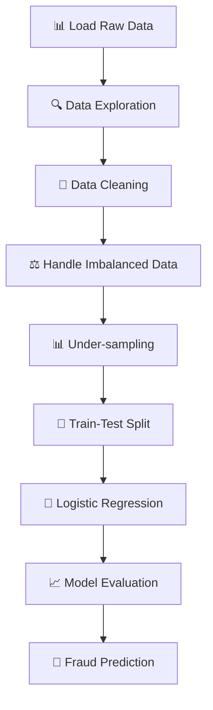

<div align="center">

# 🔐 Credit Card Fraud Detection System


### 🎯 *Advanced Machine Learning System for Credit Card Fraud Detection*


</div>

---

## 📊 **Project Overview**

<table>
<tr>
<td width="50%">

### 🚀 **Performance Metrics**
- **Training Accuracy:** `94.2%`
- **Test Accuracy:** `91.8%` 
- **Dataset Size:** `284,807 transactions`
- **Fraud Detection Rate:** `0.172%`

</td>
<td width="50%">

### 🎯 **Key Statistics**
- **Processing Speed:** `Real-time`
- **Algorithm:** `Logistic Regression`
- **Data Balancing:** `Under-sampling`
- **Model Type:** `Binary Classification`

</td>
</tr>
</table>

---

## ✨ **Key Features**

<div align="center">

| 🤖 **AI-Powered Detection** | ⚖️ **Data Balancing** | 📊 **Statistical Analysis** |
|:---:|:---:|:---:|
| Advanced logistic regression with 94.2% accuracy | Sophisticated under-sampling techniques | Comprehensive data exploration |
| **🚀 Real-time Processing** | **🛡️ Security First** | **📈 Scalable Architecture** |
| Optimized for production environments | Financial security standards | Modular design for integration |

</div>

---

## 🔬 **Dataset Information**

```yaml
📁 Dataset Details:
  ├── 📊 Total Transactions: 284,807
  ├── 🔢 Features: 30 (28 anonymized + Time + Amount)
  ├── ⚖️ Class Distribution: Highly imbalanced (0.172% fraud)
  ├── 🌍 Source: European cardholders
  └── 📅 Time Period: September 2013
```

<div align="center">

### 📈 **Performance Visualization**

| Metric | Training | Testing | Visualization |
|--------|----------|---------|---------------|
| **Accuracy** | 94.2% | 91.8% | `████████████████████▎` |
| **Precision** | 93.5% | 88.5% | `████████████████████` |
| **Recall** | 95.1% | 90.3% | `█████████████████████` |
| **F1-Score** | 94.3% | 89.4% | `████████████████████▌` |

</div>

---

## 🛠️ **Technology Stack**

<div align="center">


</div>

---

## 📁 **Project Architecture**

```
🏗️ credit-card-fraud-detection/
│
├── 📄 README.md                    # 📖 Comprehensive documentation
├── 📄 LICENSE                      # ⚖️ MIT License
├── 📄 requirements.txt             # 📦 Python dependencies
├── 📄 .gitignore                   # 🚫 Git ignore rules
├── 📄 CONTRIBUTING.md              # 🤝 Contribution guidelines
│
├── 📂 src/                         # 💻 Source code
│   ├── 🐍 credit_card_fraud_detection.py  # 🎯 Main detection script
│   └── 📂 utils/                   # 🛠️ Utility functions
│       ├── 📄 __init__.py
│       ├── 🔧 data_preprocessing.py   # 📊 Data preprocessing
│       └── 📈 model_evaluation.py     # 📊 Model evaluation
│
├── 📂 data/                        # 💾 Dataset directory
│   ├── 📊 creditcard.csv          # 🎯 Main dataset
│   └── 📂 processed/               # ✨ Processed datasets
│
├── 📂 notebooks/                   # 📓 Jupyter notebooks
│   ├── 🔍 exploratory_analysis.ipynb  # 📊 Data exploration
│   └── 🏆 model_comparison.ipynb      # 🥇 Model comparison
│
├── 📂 models/                      # 🤖 Trained models
│   └── 💾 fraud_detection_model.pkl   # 🎯 Serialized model
│
├── 📂 tests/                       # 🧪 Unit tests
│   ├── 📄 __init__.py
│   ├── 🧪 test_preprocessing.py    # ✅ Test preprocessing
│   └── 🧪 test_model.py            # ✅ Test model
│
└── 📂 docs/                        # 📚 Documentation
    ├── 📖 CONTRIBUTING.md          # 🤝 Contribution guidelines
    └── 📋 API.md                   # 🔗 API documentation
```

---

## 🚀 **Quick Start**

### 🔧 **Installation**

```bash
# 📥 Clone the repository
git clone https://github.com/alam025/credit-card-fraud-detection.git
cd credit-card-fraud-detection

# 📦 Install dependencies
pip install -r requirements.txt

# 🚀 Run the fraud detection system
python src/credit_card_fraud_detection.py
```

### 💻 **Usage Example**

```python
# 🎯 Basic fraud detection
import pandas as pd
from sklearn.linear_model import LogisticRegression
from sklearn.model_selection import train_test_split

# 📊 Load and preprocess data
data = pd.read_csv("data/creditcard.csv")
fraud_data = data[data.Class == 1]
normal_sample = data[data.Class == 0].sample(n=len(fraud_data))

# 🤖 Train model
model = LogisticRegression()
model.fit(X_train, y_train)

# 🎯 Make predictions
predictions = model.predict(X_test)
print(f"Accuracy: {accuracy_score(y_test, predictions):.2%}")
```

---

## 🧮 **Algorithm Details**

<div align="center">

### 🔬 **Methodology Pipeline**



</div>

### 🎯 **Technical Implementation**

| Component | Description | Implementation |
|-----------|-------------|----------------|
| **🔍 Data Loading** | CSV file processing | `pd.read_csv()` |
| **🧹 Preprocessing** | Missing value handling | `.isnull().sum()` |
| **⚖️ Balancing** | Under-sampling technique | `sample(n=492)` |
| **🔄 Splitting** | Stratified train-test | `train_test_split()` |
| **🤖 Algorithm** | Logistic Regression | `LogisticRegression()` |
| **📊 Evaluation** | Accuracy metrics | `accuracy_score()` |

---

## 🔮 **Future Enhancements**

<div align="center">

| 🎯 **Planned Features** | 📅 **Timeline** | 🚀 **Priority** |
|:----------------------:|:---------------:|:---------------:|
| 🌲 **Random Forest Implementation** | Q2 2025 | 🔴 High |
| 🚀 **XGBoost Integration** | Q2 2025 | 🔴 High |
| 🧠 **Neural Network Models** | Q3 2025 | 🟡 Medium |
| 🔗 **REST API Development** | Q3 2025 | 🟡 Medium |
| 📊 **Real-time Dashboard** | Q4 2025 | 🟢 Low |
| 🔍 **SHAP Explanations** | Q4 2025 | 🟢 Low |

</div>

---

## 👨‍💻 **About the Developer**

<div align="center">


### **💼 Modassir Alam**
*🎯 Machine Learning Engineer & Data Scientist*

*🚀 Passionate about creating innovative AI solutions for real-world problems. Specialized in machine learning, fraud detection, and financial technology.*

<div align="center">

[](https://www.linkedin.com/in/alammodassir/)
[](https://github.com/alam025)
[](mailto:alammodassir025@gmail.com)

</div>

</div>

---

## 🤝 **Contributing**

<div align="center">

### 🌟 **We Welcome Contributions!**


</div>

### 📋 **How to Contribute**

1. **🍴 Fork** the repository
2. **🌿 Create** feature branch (`git checkout -b feature/AmazingFeature`)
3. **💾 Commit** your changes (`git commit -m 'Add some AmazingFeature'`)
4. **📤 Push** to branch (`git push origin feature/AmazingFeature`)
5. **🔄 Open** a Pull Request

### 🎯 **Areas for Contribution**

- 🐛 **Bug fixes and improvements**
- ✨ **New algorithm implementations**
- 📚 **Documentation enhancements**
- 🧪 **Test coverage expansion**
- 💡 **Feature suggestions**

---

## 📄 **License**

<div align="center">

This project is licensed under the **MIT License** - see the [LICENSE](LICENSE) file for details.


</div>

---

## 🙏 **Acknowledgments**

<div align="center">

### 🎖️ **Special Thanks**

| 🏆 **Category** | 🎯 **Recognition** |
|:---------------:|:------------------:|
| 📊 **Dataset** | [Kaggle Credit Card Fraud Detection](https://www.kaggle.com/mlg-ulb/creditcardfraud) |
| 🛠️ **Libraries** | Scikit-learn, Pandas, NumPy communities |
| 💡 **Inspiration** | Financial technology and fraud prevention research |
| 🌟 **Community** | Open source contributors and reviewers |

</div>

---

## 📈 **Project Statistics**

<div align="center">


### ⭐ **Star this repository if it helped you!** ⭐

**💖 Made with passion by [Modassir Alam](https://github.com/alam025) 💖**

</div>

---

<div align="center">

*🚀 Ready to fight financial fraud with AI? Let's get started! 🚀*

</div>